# Báo Cáo Kết Quả Bài Tập Cuối Khoá OOP

## 1. Thông Tin Nhóm

**Tên Dự Án:** Dodo App

**Link Dự Án:** [GitHub Link](https://github.com/BtckJava/timetable-ai)

**Thành Viên Nhóm:**
- Trần Quang Minh
- Nguyễn Hoàng Trung
- Nguyễn Hạnh Nhi
- Nguyễn Viết Hoàn
- Mentor: Nguyễn Văn Minh Lực & Nguyễn Trọng Toàn

### Mô hình làm việc

Team hoạt động theo mô hình Scrum, sử dụng Linear để quản lý công việc. Các công việc được keep track đầy đủ trên Linear.
- Link linear: [Linear](https://linear.app/dodo-timetable-ai/team/DOD/active)

Mỗi tuần, team sẽ ngồi lại để review công việc đã làm, cùng nhau giải quyết vấn đề và đề xuất giải pháp cho tuần tiếp theo. Sau đó sẽ có buổi demo cho mentor để nhận phản hồi và hướng dẫn.

### Version Control Strategy


Team hoạt động theo Gitflow để quản lý code. Mỗi thành viên sẽ tạo branch từ `dev` để làm việc, các branch đặt theo format `feature/ten-chuc-nang`, sau khi hoàn thành sẽ tạo Pull Request để review code và merge vào dev
- Các nhánh chính:
  - `main`: Chứa code ổn định, đã qua kiểm tra và test kỹ lưỡng
  - `dev`: Chứa code mới nhất, đã qua review và test
  - `feature/`: Các nhánh chứa code đang phát triển, short-live, sau khi hoàn thành sẽ merge vào `dev`. 

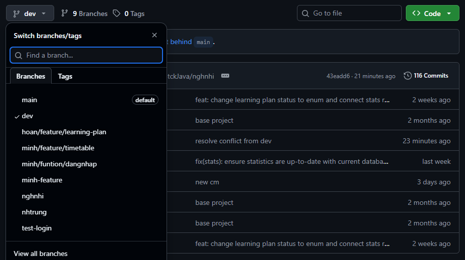
Sau mỗi tuần, team sẽ merge `dev` vào `main` để release phiên bản mới.


## 2. Giới Thiệu Dự Án

**Mô tả:** DoDo là ứng dụng quản lý thời khóa biểu thông minh. Điểm khác biệt cốt lõi là việc ứng dụng AI (OpenRouter) để tự động hóa lộ trình học tập và hệ thống nhắc nhở đa nền tảng qua Email, giúp người dùng không bỏ lỡ các mục tiêu cá nhân.

## 3. Các Chức Năng Chính

- [**Nhóm chức năng Hệ thống & Bảo mật**]:
  - **Quản lý người dùng**: Đăng ký tài khoản mới, đăng nhập và xác thực, đổi mật khẩu.
- [**Nhóm chức năng Lập kế hoạch với AI**]
  - **Tạo lộ trình thông minh**: Sử dụng OpenRouterAI để phân tích chủ đề người dùng muốn học và tự động sinh ra các LearningPlan.
  - **Phân bổ lịch trình**: Tự động chia nhỏ lộ trình thành các ScheduleSlot dựa trên đề xuất của AI.
- [**Nhóm chức năng Thời khóa biểu**]
  - **Hiển thị lịch trình**: Hiển thị danh sách các buổi học trực quan.
  - **Quản lý trạng thái**: Cập nhật trạng thái của từng slot học (Hoàn thành/Chưa hoàn thành)
- [**Nhóm chức năng Nhắc nhở**]
  - **Nhắc lịch tự động**: Gửi dữ liệu từ app chính sang mailservice.
  - **Gửi Email**: Thực hiện gửi email nhắc nhở người dùng học tập đúng giờ.
- [**Nhóm chức năng Tiện ích**]
  -  Export lịch trình ra file .ics để người dùng dễ dàng import vào Google Calendar.
  -  Đồng hồ Pomodoro: Tích hợp bộ đếm giờ theo phương pháp Pomodoro (25 phút tập trung, 5 phút nghỉ ngắn, 15 phút nghỉ dài) ngay trên giao diện lịch học.


## 4. Công nghệ

### 4.1. Công Nghệ Sử Dụng  
- Ngôn ngữ: Java (JDK 21)
- Giao diện: JavaFX (FXML & CSS)
- Database: Hibernate / JPA kết hợp PostgreSQL
- Mailing: Spring Boot Email Starter
- AI: OpenRouter API
- Scheduling: JobRunr


### 4.2. Kiến trúc hệ thống

Hệ thống bao gồm hai thành phần độc lập giao tiếp với nhau thông qua giao thức HTTP và định dạng dữ liệu JSON, đảm bảo tính độc lập và khả năng mở rộng (Scalability).

- DoDo Main App (Java): Xử lý giao diện và nghiệp vụ chính.

- Mail Service (Spring Boot): Một dịch vụ riêng biệt chuyên trách việc gửi email, giúp tách biệt hoàn toàn logic thông báo khỏi ứng dụng chính.

### 4.3. Cấu trúc phân lớp và Mô hình triển khai

Dự án DoDo App được thiết kế theo Kiến trúc phân lớp (Layered Architecture) kết hợp với mô hình MVC (Model-View-Controller), nhằm đảm bảo tính rời rạc, dễ bảo trì và dễ dàng mở rộng trong tương lai. Hệ thống được chia thành 3 lớp chính:

1. **Presentation Layer (Tầng giao diện - MVC):**

   - View (FXML & CSS): Chịu trách nhiệm hiển thị giao diện người dùng (UI) như màn hình đăng nhập, thời khóa biểu, biểu đồ tiến độ.
   - Controller: Tiếp nhận các sự kiện từ người dùng (click, nhập liệu), gọi đến tầng Service để xử lý nghiệp vụ và cập nhật lại kết quả lên View. (Ví dụ: LoginController, TimetableController...).
   
2. **Business Logic Layer (Tầng nghiệp vụ - Service):**

- Đây là trái tim của ứng dụng, chứa toàn bộ logic xử lý phức tạp. Tầng này hoàn toàn độc lập với giao diện, giúp code có thể tái sử dụng.

- Xử lý việc giao tiếp với OpenRouter API để sinh lộ trình học, chia nhỏ các ScheduleSlot... (Ví dụ: LearningPlanService).

3. **Data Access Layer (Tầng truy cập dữ liệu - Repository & Entity):**

- Sử dụng Repository Pattern để trừu tượng hóa các thao tác tương tác với cơ sở dữ liệu PostgreSQL thông qua Hibernate/JPA.

- Tầng này cung cấp các hàm (CRUD) để Service gọi xuống mà không cần quan tâm đến câu lệnh SQL bên dưới. Việc này tuân thủ chặt chẽ tính Đóng gói (Encapsulation) trong OOP.

**Áp dụng Design Patterns:**
Bên cạnh kiến trúc tổng thể, dự án còn áp dụng một số Design Pattern cốt lõi:

- Singleton Pattern: Áp dụng cho SessionManager để lưu trữ thông tin User đang đăng nhập duy nhất trong suốt vòng đời ứng dụng; và HibernateUtil để quản lý Connection Factory, tránh rò rỉ bộ nhớ.

- Data Transfer Object (DTO): Sử dụng các class DTO ở request/response để bọc dữ liệu, tránh việc lộ cấu trúc Entity thật ra ngoài View hoặc khi giao tiếp với API bên ngoài.

### 4.4 Cấu trúc dự án

Client Application
```
com.ocr.javafx
├── config/             # Cấu hình hệ thống 
├── controller/         # Controller (Base, Login, Timetable...)
├── dto/                # Data Transfer Objects (Request/Response)
│   ├── request/        # DTO cho dữ liệu gửi đi (Auth, Reminder...)
│   └── response/       # DTO nhận về từ API/Service
├── entity/             # Mapping Database (User, LearningPlan, ScheduledSlot...)
├── enums/              # Định nghĩa các hằng số (Status, Role)
├── repository/         # Tầng truy vấn dữ liệu (Hibernate/JPA)
├── service/            # Tầng nghiệp vụ (AuthService, LearningPlanService, OpenRouterAI...)
├── util/               # Helper classes (DateFormatter, SessionManager)
└── MainApplication     # Điểm khởi chạy JavaFX
resources/
├── views/              # Chứa các file giao diện (.fxml)
...
├── style/              # Chứa các file định dạng giao diện (.css)
├── image/              # Chứa icon, logo, hình ảnh minh họa
├── db/                 # Scripts khởi tạo Database
├── application.properties # Cấu hình môi trường
└── hibernate.cfg.xml   # Cấu hình Hibernate ORM
```

Mail Service

```
com.ocr.mailservice
├── controller/ # Tiếp nhận yêu cầu gửi mail (ReminderController)
├── dto/ # Định dạng dữ liệu yêu cầu (ReminderRequest)
├── service/ # Logic gửi mail thực tế (EmailService)
└── MailServiceApplication # Điểm khởi chạy dịch vụ Mail
```

### 4.5. Hạ tầng và Triển khai (Infrastructure & Deployment)

Hệ thống được triển khai theo mô hình phân tán, tách biệt giữa Client và Background Services để tối ưu hiệu năng và đảm bảo thông báo luôn được gửi đúng giờ ngay cả khi người dùng không mở ứng dụng.

- **Cloud Database (PostgreSQL):** Sử dụng **Neon Tech** (Serverless Postgres) làm cơ sở dữ liệu lưu trữ đám mây chính. Neon cung cấp khả năng tự động giãn nở (autoscaling) và đồng bộ dữ liệu thời gian thực giữa JavaFX Client và Mail Service. Hệ thống cũng tự động khởi tạo các bảng `jobrunr_*` để quản lý hàng đợi gửi mail.
- **Mail Service (Spring Boot):** Triển khai trực tiếp lên **Render** (Platform-as-a-Service) thông qua quy trình CI/CD tự động từ GitHub. Các thông tin nhạy cảm (Credentials, Database URL, Mail Password) được bảo mật hoàn toàn qua cơ chế Environment Variables của Render.
- **Dịch vụ SMTP (Gửi Email):** Tích hợp dịch vụ **Brevo (Sendinblue)** và **Gmail SMTP** qua cổng bảo mật SSL (Port 465/2525) để thực hiện gửi mail định dạng HTML, tránh tình trạng bị các bộ lọc đưa vào hòm Thư rác (Spam).
- **Client Application (JavaFX):** Đóng gói thành file thực thi `.jar`, giao tiếp với Server thông qua RESTful API kết hợp Header bảo mật định danh (`X-Internal-Key`) để cấp quyền gọi lệnh đặt/hủy lịch nhắc nhở.


## 5. Ảnh và Video Demo

**Ảnh Demo:**
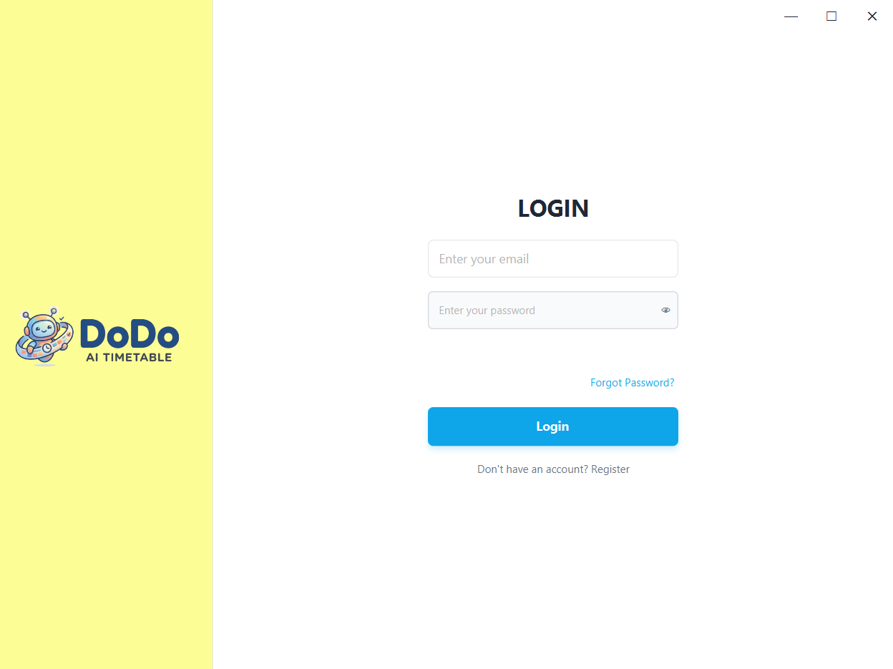
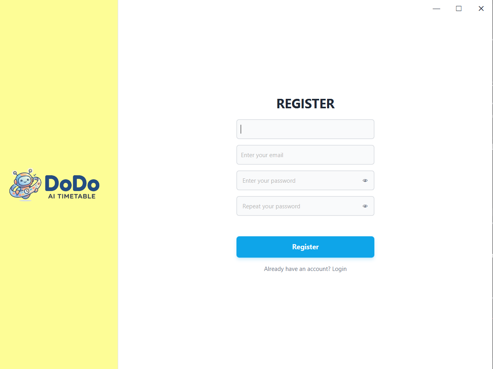
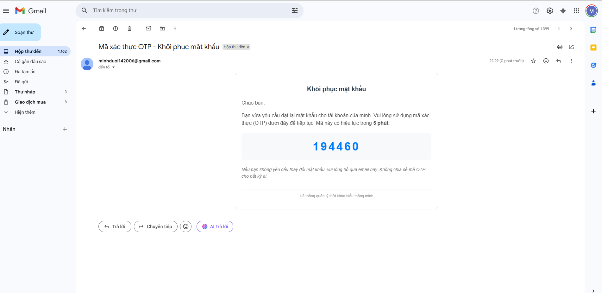
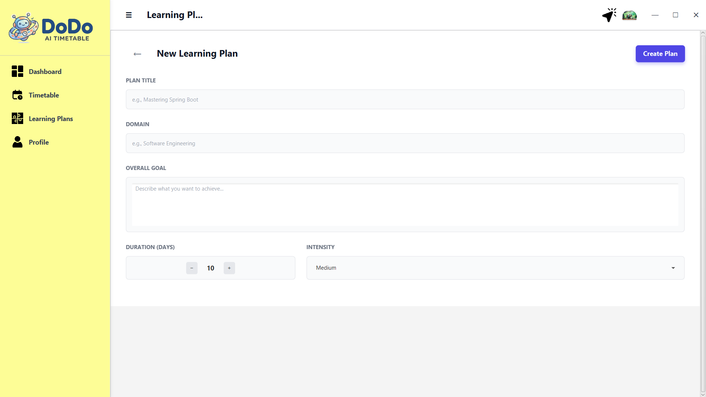
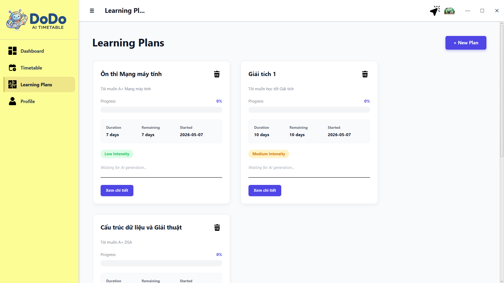
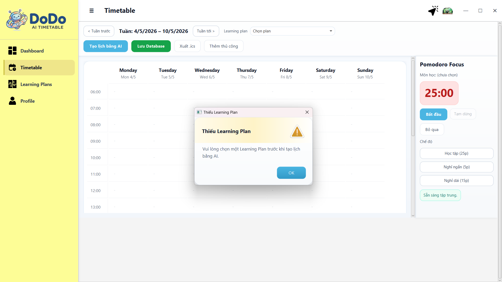
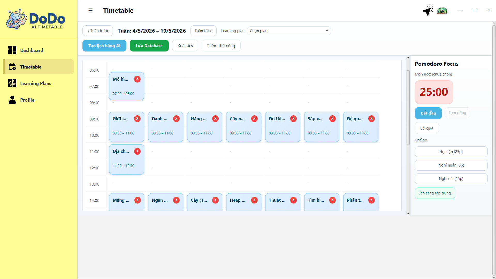
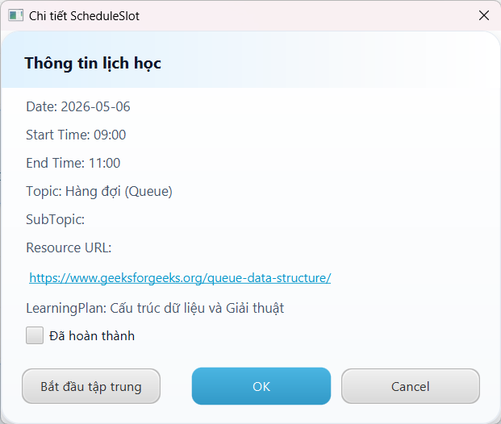
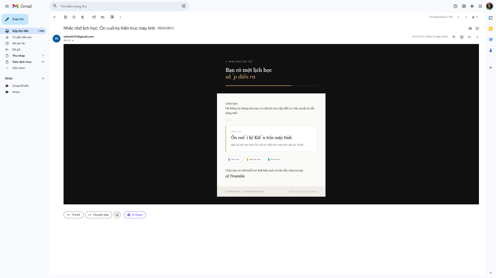
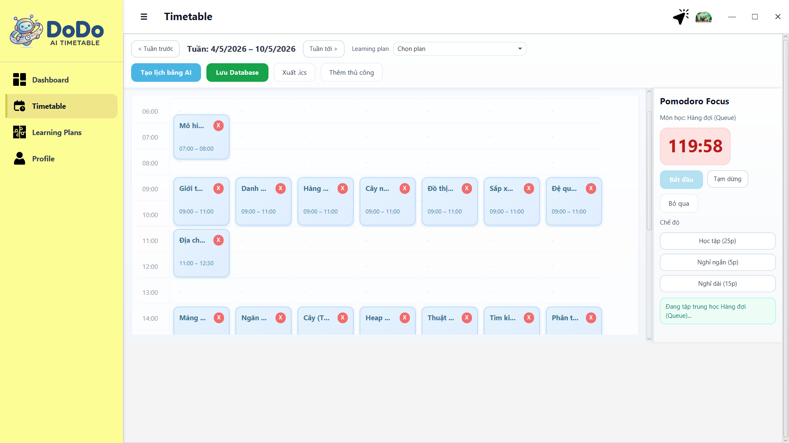
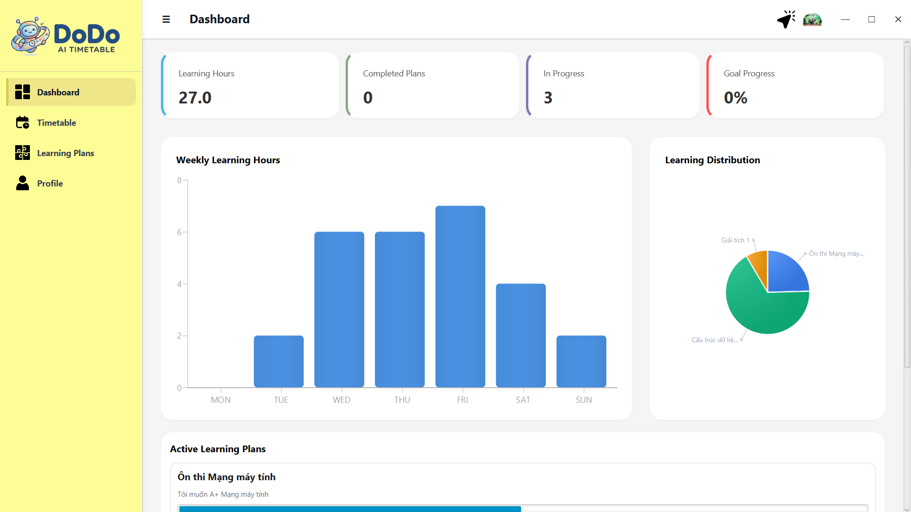
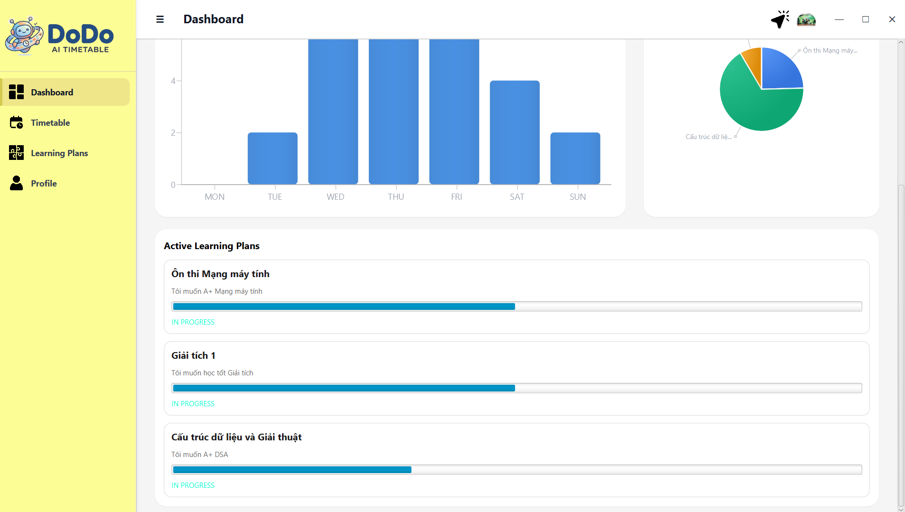
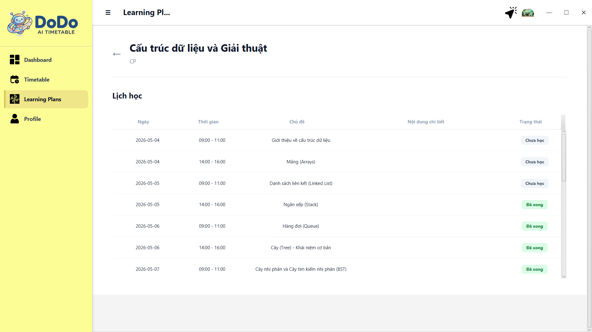
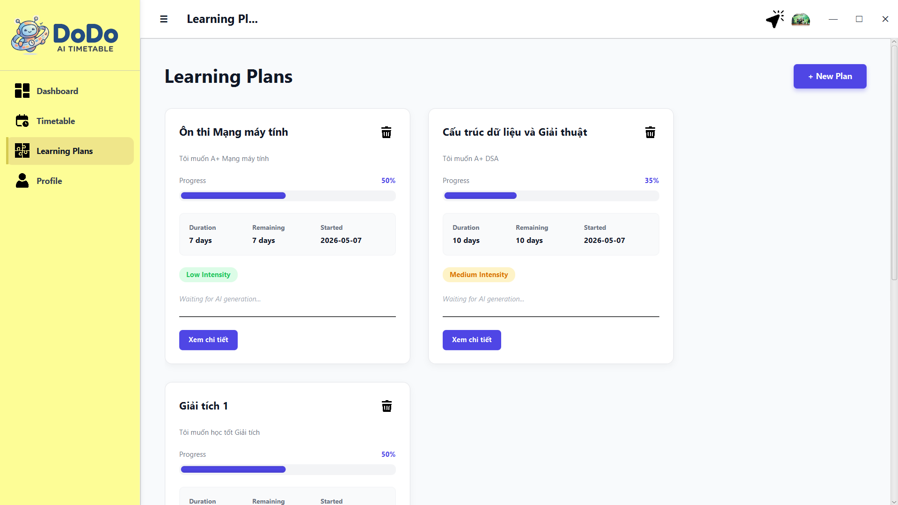
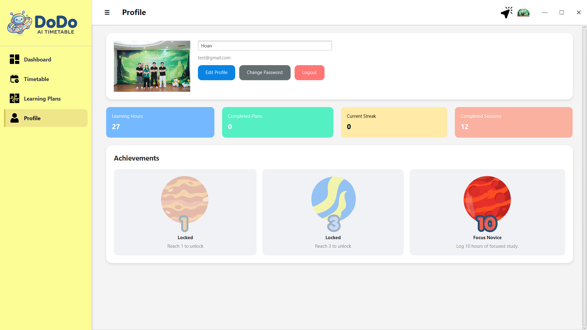
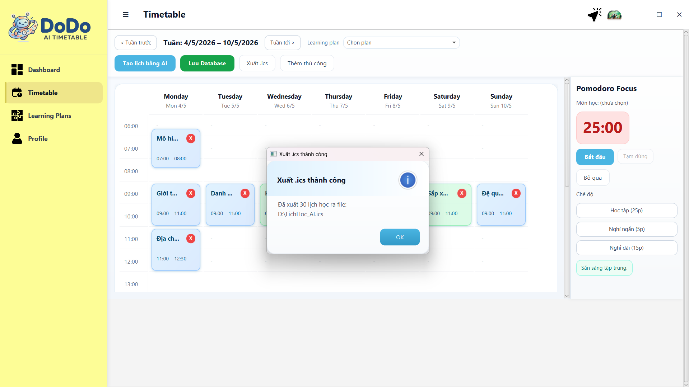
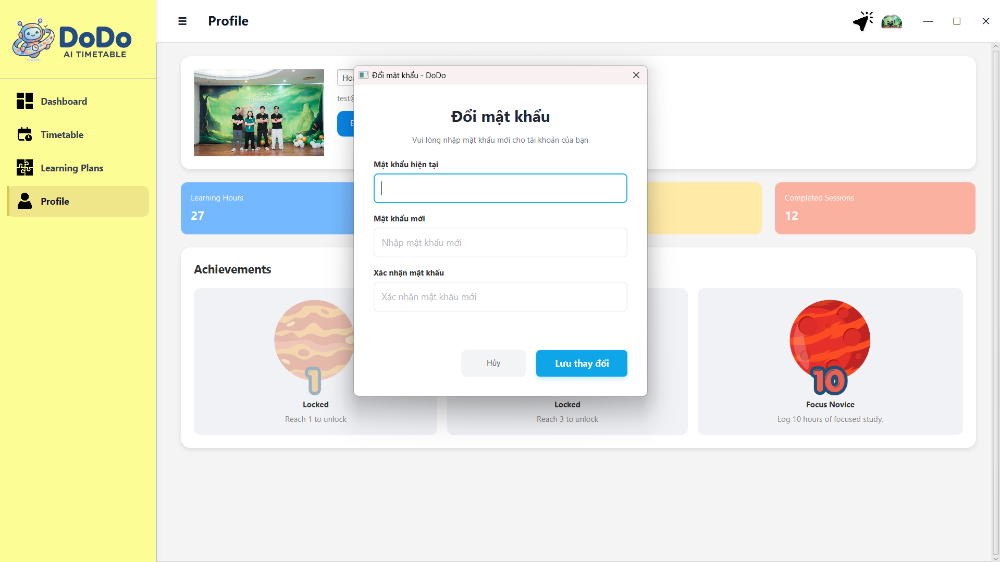


**Video Demo:**
[Video Link](#)


## 6. Các Vấn Đề Gặp Phải

#### Vấn đề 1: AI tạo lịch trùng lặp hoặc chưa tối ưu

- Mô tả: Đôi khi AI phản hồi các mốc thời gian bị chồng chéo lên nhau.

##### Giải pháp:
- Triển khai tính năng kéo thả để người dùng chủ động điều chỉnh lịch sau khi AI khởi tạo.
- Nâng cấp Prompt và sử dụng model mạnh hơn từ OpenRouter để tăng độ chính xác.

#### Vấn Đề 2: Hiệu năng Database kém (Lỗi N + 1 Query)

- **Hành động để giải quyết**: Tối ưu hóa các câu lệnh Query Database thông qua việc sử dụng `JOIN FETCH` trong Hibernate để lấy dữ liệu liên quan trong một lần truy vấn duy nhất thay vì thực hiện hàng loạt truy vấn nhỏ lẻ.

- **Kết quả**: Tốc độ tải dữ liệu thời khóa biểu nhanh hơn, giảm tải đáng kể cho server PostgreSQL.

#### Vấn Đề 3: Lỗi duplicate object khi lưu Database

- **Mô tả**: Khi người dùng tương tác với ứng dụng, cụ thể là tích chọn trạng thái "Đã hoàn thành" cho một ô lịch trình (ScheduleSlot) và thực hiện thao tác lưu, hệ thống gặp lỗi khiến một đối tượng bị nhân bản thành rất nhiều bản ghi giống nhau trong Database.

- **Hành động để giải quyết**:  
  - Chuyển đổi từ lệnh save() (luôn mặc định tạo mới) sang cơ chế merge() (Upsert - Update hoặc Insert). Hệ thống được lập trình để kiểm tra sự tồn tại của slotId trong Database trước khi thực hiện thao tác ghi.
  - Thiết lập quy trình: "Xóa trên RAM trước - Đánh dấu chờ xử lý - Xác nhận lưu Database". Các thay đổi trên giao diện không tác động trực tiếp vào Database cho đến khi người dùng chủ động bấm nút "Lưu".

- **Kết quả:** Loại bỏ tình trạng nhân bản dữ liệu, đảm bảo tính toàn vẹn của lịch trình.

#### Vấn Đề 4: Lỗi hiển thị PieChart bị thu nhỏ do Label

- **Mô tả**: Biểu đồ hình quạt (PieChart) trong ứng dụng tự động bị thu nhỏ lại một cách bất thường, làm mất cân đối giao diện và gây khó khăn cho người dùng khi theo dõi dữ liệu trực quan.

- **Hành động để giải quyết**: Trong JavaFX, Label của PieChart được ưu tiên hiển thị nên làm biểu đồ tự động thu nhỏ dù đã set Min Size. Giải pháp là thiết lập mức số chữ hiển thị tối đa của Label là 15 ký tự, phần sau đó gán bằng dấu "..." để Label không quá dài.

- **Kết quả**: PieChart luôn giữ được kích thước chuẩn, dễ nhìn, trong khi vẫn cung cấp đủ thông tin qua các Label rút gọn.

#### Vấn Đề 5: Vấn đề làm việc nhóm và công cụ quản lý chưa hiệu quả

- **Mô tả**: Trong giai đoạn đầu, nhóm gặp khó khăn lớn trong việc thống nhất ý kiến trước khi triển khai tính năng, dẫn đến sự thiếu đồng bộ trong code và logic ứng dụng. Mặc dù đã được hướng dẫn sử dụng Linear để quản lý công việc, nhưng chưa thực sự chú tâm, dẫn đến việc khó kiểm soát tiến độ chung. Ngoài ra, việc đẩy code trực tiếp mà không qua kiểm tra đã gây ra tình trạng xung đột mã nguồn (conflict) thường xuyên.

- **Hành động để giải quyết**: 
  - Thiết lập quy tắc Gitflow nghiêm ngặt: Bắt buộc mọi tính năng mới phải được phát triển trên nhánh feature/ riêng biệt. Chỉ khi được ít nhất một thành viên khác review và phê duyệt Pull Request mới được phép merge vào nhánh dev.

  - Sử dụng Linear hiệu quả hơn.

  - Tăng cường trao đổi trước khi code: Tổ chức các buổi họp ngắn để thống nhất cấu trúc dữ liệu và logic Service trước khi bắt tay vào hiện thực hóa nhằm tránh chồng chéo.

#### Vấn Đề 6: Lỗi đồng bộ hóa và spam mail trong hệ thống phân tán
- **Mô tả**: Khi ứng dụng được tách biệt thành 2 hệ thống độc lập (JavaFX Client và Spring Boot Mail Service), việc gửi mail nhắc nhở gặp tình trạng "spam" (gửi nhiều email cho cùng một lịch trình) hoặc mất kết nối giữa lịch trình trên ứng dụng và Job gửi mail trên server. Điều này xảy ra khi người dùng chỉnh sửa hoặc xóa lịch nhiều lần, khiến Server tạo ra hàng loạt Job thừa thãi.

- **Hành động để giải quyết**: 
  - Định danh hóa lịch trình (Unique Key Mapping): Sử dụng chính slotId (Khóa chính từ PostgreSQL) làm "thẻ căn cước" duy nhất cho mỗi lịch trình.
  - Cơ chế Idempotent (Bất biến): Xây dựng bộ ánh xạ (ConcurrentHashMap) trên Mail Service để kết nối slotId với Job UUID.
  - Cơ chế Hủy và Cập nhật (Upsert Jobs):
    + Trước khi tạo Job mới, hệ thống sẽ tra cứu slotId trong Map.
    + Nếu tìm thấy, thực hiện lệnh `BackgroundJob.delete(uuid)` để hủy Job cũ, sau đó mới tạo Job mới.
    + Bổ sung API `DELETE` để hủy Job ngay lập tức khi người dùng xóa lịch trên ứng dụng.


#### Vấn Đề 7: Giao diện (UI) bị treo khi Server Mail phản hồi chậm hoặc sập
- **Mô tả:** Do sử dụng gói Cloud Render, Mail Server thường xuyên rơi vào trạng thái "ngủ" (Cold start) hoặc bị quá tải mạng. Khi đó, nếu JavaFX Client cố gắng đồng bộ hàng loạt lịch trình, các luồng (Thread) gọi HTTP API sẽ bị treo (timeout), dẫn đến toàn bộ giao diện ứng dụng của người dùng bị đơ cứng (freeze) và gây ra hiện tượng dội bom (spam request) khi Server vừa thức dậy.
- **Hành động để giải quyết:** Áp dụng mẫu thiết kế **Circuit Breaker (Ngắt mạch)** kết hợp cơ chế **Retry (Thử lại)** tại tầng Client (`MailSyncService`):
  - **Cơ chế Retry:** Khi HTTP request thất bại (lỗi 5xx hoặc timeout), hệ thống tự động thử lại tối đa 3 lần với thời gian trễ (delay) giữa các lần gọi.
  - **Cơ chế Circuit Breaker:** Nếu việc đồng bộ thất bại liên tiếp 3 lần, hệ thống sẽ tự động "ngắt cầu dao" (Open Circuit). Trong 60 giây tiếp theo, mọi yêu cầu đồng bộ Mail sẽ bị từ chối ngay lập tức tại Client (Fast-fail) thay vì gửi lên Server.
  - **Tối ưu UI:** Gom nhóm các thông báo lỗi (Toast) thông qua `SyncUiHints` để không hiển thị hàng loạt thông báo làm phiền người dùng.
- **Kết quả:** Ứng dụng Client hoạt động mượt mà, chịu lỗi tốt (Fault-tolerant). Bảo vệ được Server khỏi các đợt tấn công DDoS cục bộ do lỗi logic, và cải thiện tối đa trải nghiệm người dùng ngay cả khi hạ tầng mạng không ổn định.
## 7. Kết Luận

**Kết quả đạt được:** Ứng dụng đã hoàn thiện các tính năng cốt lõi, giải quyết các vấn đề về hiệu năng và dữ liệu.

**Hướng phát triển tiếp theo:** 

- Thông báo trên app: Xây dựng bộ phận hiển thị thông báo trực tiếp trên màn hình máy tính bên cạnh việc gửi Mail. Điều này giúp người dùng nhận được nhắc nhở tức thời mà không cần mở trình duyệt hay ứng dụng Email.

- Cá nhân hóa tần suất nhắc hẹn: Cho phép người dùng tùy chỉnh thời gian nhận thông báo (trước 5 phút, 15 phút hoặc 1 giờ) cho từng loại công việc cụ thể. (Hiện tại chỉ nhắc trước 5 phút)

- Thêm tính năng Takenote khi đang học.

